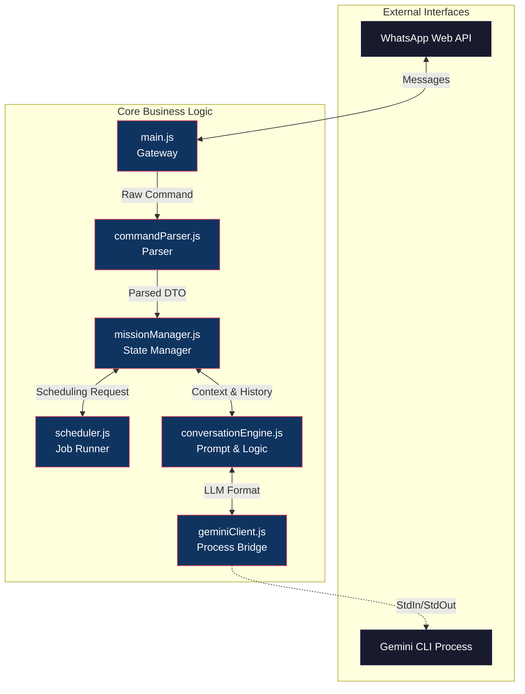
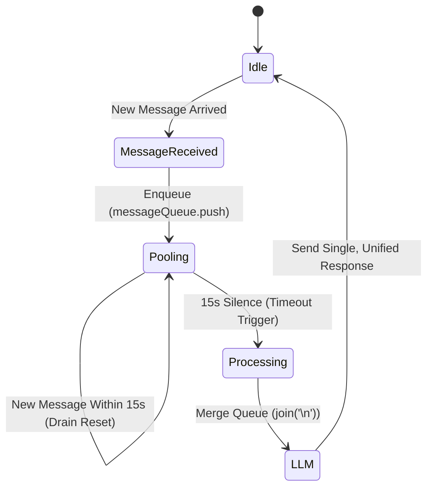
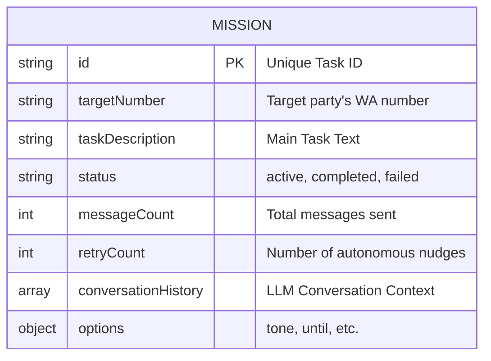

# System Architecture Overview

This document details the internal working principles, modular structure, and data persistence strategies of the Gemini-powered Autonomous WhatsApp Agent. The project is designed with an event-driven architecture in the Node.js ecosystem.

## 🏗️ Core Flow and Modules

The system consists of 6 main modules strictly adhering to the Separation of Concerns principle:



### 1. Gateway (`main.js`)
The system's entry point. Initializes the `whatsapp-web.js` client, manages authentication (QR Auth), and filters all incoming traffic, routing it to the `commandParser` and `missionManager` modules.

### 2. State Manager (`missionManager.js`)
The brain of the system. Tracks the statuses of autonomous tasks (Active, Completed, Failed), synchronizes in-memory data, and provides disk-based persistence (`active_missions.json`).
- **Message Pooling:** Manages a dedicated timer that captures and batches incoming consecutive messages.

### 3. Intelligence Engine (`conversationEngine.js`)
The bridge between the LLM and the application. Contains advanced prompt engineering techniques. Forces the LLM to respect required boundaries, time information, and output contracts so that autonomous decisions can be made.

---

## ⏳ Message Pooling Process

The pooling mechanism is used to avoid giving separate nonsensical replies to consecutive messages (e.g., "Okay", "I'll handle it tomorrow", "Around 10 AM") and to reduce API costs.



---

## 🧠 Layered Prompt Architecture

The `buildSystemPrompt` method inside `conversationEngine.js` constructs the LLM's identity and boundaries using a 5-layer architecture. This prevents the LLM from hallucinating.

1. **Identity Layer:** The bot's name and who it represents.
2. **Task Layer:** The problem it is currently trying to solve (`taskDescription`).
3. **Behavior Layer:** Tone rules, anti-repetition directives.
4. **Awareness Layer:** How to interpret the `[TIME: ...]` tag dynamically injected into incoming messages.
5. **Output Contract Layer:** Strict JSON format enforcement.

### Output Contract (JSON Schema)

Every decision made by the LLM must return to the application in the following strict JSON format:

```json
{
  "reply": "Text to be sent to the other party",
  "status": "active | completed | failed",
  "memberStatus": {
    "Ali": "Sent the files",
    "Ayse": "Will reply over the weekend"
  }
}
```

> [!WARNING]
> The LLM can sometimes corrupt the JSON format or include a Markdown block inside it. The `_processResponse` method cleans and parses this string into a parseable form using aggressive Regex and fallback mechanisms.

---

## 💾 Data Model and Persistence

To prevent data loss in the event of server shutdowns, power outages, or manual restarts, active tasks are written to disk instantly (`data/active_missions.json`).



`scheduler.js` scans this JSON file when the application first starts. If a task is `active` and has a pending wait time, it re-establishes the timers (setTimeout) in memory. This allows the agent to execute tasks spanning weeks without losing its state.
