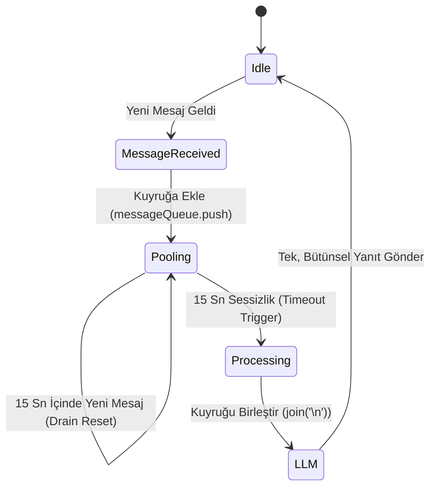
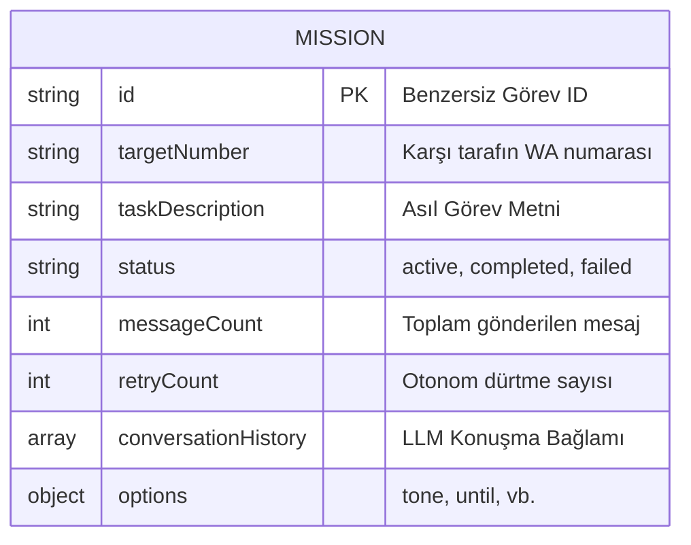

# Sistem Mimarisi (Architecture Overview)

Bu doküman, Gemini destekli Otonom WhatsApp Ajanı'nın iç çalışma prensiplerini, modüler yapısını ve veri kalıcılığı (data persistence) stratejilerini detaylandırmaktadır. Proje, Node.js ekosisteminde olay güdümlü (event-driven) bir mimari ile tasarlanmıştır.

## 🏗️ Çekirdek Akış ve Modüller

Sistem, ayrık sorumluluk prensibine (Separation of Concerns) sıkı sıkıya bağlı 6 ana modülden oluşmaktadır:


### 1. Gateway (`main.js`)
Sistemin giriş noktasıdır. `whatsapp-web.js` istemcisini ayağa kaldırır, yetkilendirmeyi (QR Auth) yönetir ve gelen tüm trafiği filtreleyip `commandParser` ve `missionManager` modüllerine yönlendirir.

### 2. State Manager (`missionManager.js`)
Sistemin beynidir. Otonom görevlerin durumlarını (Active, Completed, Failed) izler, bellekteki verileri senkronize eder ve disk tabanlı kalıcılığı (`active_missions.json`) sağlar.
- **Message Pooling:** Gelen peş peşe mesajları yakalayan ve yığınlaştıran (batching) özel bir zamanlayıcı yönetir.

### 3. Zeka Motoru (`conversationEngine.js`)
LLM ile uygulama arasındaki köprüdür. Gelişmiş prompt mühendisliği (Prompt Engineering) tekniklerini barındırır. Otonom kararların alınabilmesi için LLM'e gerekli sınırları, zaman bilgisini ve çıktı kontratlarını zorlar.

---

## ⏳ Mesaj Havuzu (Message Pooling) Süreci

Karşı tarafın peş peşe gönderdiği (örn: "Tamam", "Yarın hallederim", "Saat 10 gibi") mesajlara tek tek saçma cevaplar vermemek ve API maliyetlerini düşürmek için pooling mekanizması kullanılır.



---

## 🧠 Katmanlı Prompt Mimarisi

`conversationEngine.js` içindeki `buildSystemPrompt` metodu, LLM'in kimliğini ve sınırlarını 5 katmanlı bir mimariyle oluşturur. Bu, LLM'in halüsinasyon görmesini (hallucination) engeller.

1. **Kimlik Katmanı:** Botun adı, kimi temsil ettiği.
2. **Görev Katmanı:** O an çözmeye çalıştığı problem (`taskDescription`).
3. **Davranış Katmanı:** Üslup kuralları, tekrara düşmeme emirleri.
4. **Farkındalık Katmanı:** Gelen mesajlara dinamik enjekte edilen `[SAAT: ...]` etiketinin nasıl yorumlanacağı.
5. **Çıktı Kontratı Katmanı:** Kesin JSON format zorunluluğu.

### Çıktı Kontratı (JSON Schema)

LLM'in verdiği her karar uygulamaya aşağıdaki katı JSON formatında dönmek zorundadır:

```json
{
  "reply": "Karşı tarafa gönderilecek metin",
  "status": "active | completed | failed",
  "memberStatus": {
    "Ali": "Dosyaları gönderdi",
    "Ayşe": "Hafta sonu dönüş yapacak"
  }
}
```

> [!WARNING]
> LLM bazen JSON formatını bozabilir veya içine Markdown bloğu ekleyebilir. `_processResponse` metodu, agresif Regex ve fallback mekanizmalarıyla bu string'i temizleyip parse edilebilir hale getirir.

---

## 💾 Veri Modeli ve Kalıcılık (Data Persistence)

Sunucu kapanmaları, elektrik kesintileri veya manuel yeniden başlatmalara karşı veri kaybını önlemek için aktif görevler anlık olarak dosyaya yazılır (`data/active_missions.json`).



`scheduler.js`, uygulama ilk açıldığında bu JSON dosyasını tarar. Eğer görev `active` ise ve bekleme süresi varsa, zamanlayıcıları (setTimeout) bellek üzerinde yeniden kurar. Böylece ajan, haftalar süren görevleri bile hafızası silinmeden yürütebilir.
