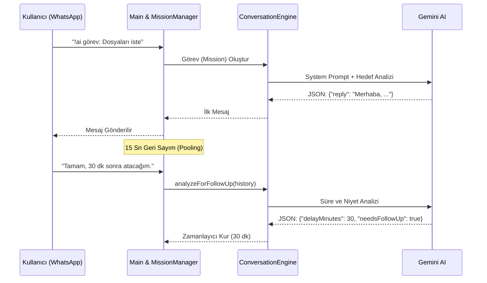

<div align="center">
  
  
  
  
</div>

# Otonom WhatsApp Ajanı (Gemini Destekli)

> **Elevator Pitch:** WhatsApp üzerinden kendi adınıza pazarlık yapabilen, dosya isteyebilen ve verilen sözleri takip eden tam otonom bir iletişim motoru. Google Gemini AI'nin üstün muhakeme yeteneğini kullanarak, tıpkı insan gibi asenkron iletişim kurar ve görevleri sonuçlandırana kadar peşini bırakmaz.

## 📖 İçindekiler
- [✨ Özellikler](#-özellikler)
- [🚀 Hızlı Başlangıç](#-hızlı-başlangıç)
- [🏗️ Mimariye Genel Bakış](#️-mimariye-genel-bakış)
- [💻 Kullanım & API Referansı](#-kullanım--api-referansı)
- [🤝 Katkıda Bulunma](#-katkıda-bulunma)

---

## ✨ Özellikler

- **Tam Otonom İletişim:** Verilen görevi statik komutlarla değil, doğal dil işleme (NLP) yeteneğiyle dinamik olarak yönetir.
- **Zaman Farkındalığı & Otonom Takip (Follow-up):** Karşı tarafın verdiği süreleri (örn: "yarım saat sonra atarım") analiz eder ve süresi geldiğinde insan doğallığında hatırlatmalar yapar.
- **Akıllı Mesaj Havuzu (Pooling):** Peş peşe gelen 15 saniye içindeki tüm mesajları birleştirerek tek, tutarlı ve bağlamsal bir cevap üretir. API maliyetlerini düşürür ve "her cümleye ayrı cevap" sorununu ortadan kaldırır.
- **Hata Toleransı (Resilience):** Sunucu kapansa dahi `data/active_missions.json` üzerinden durum (state) korunur. Açıldığında otonom görevler kaldığı yerden devam eder.
- **Grup ve Birebir DX:** Grup içi diyaloglarda katılımcıları isimlerinden tanır ve doğrudan ilgili kişiye hitap eder.

---

## 🚀 Hızlı Başlangıç

### Ön Koşullar
- **Node.js:** v18.x veya üzeri.
- **Gemini CLI:** Sistemde global olarak yapılandırılmış, headless modda çalışabilen `gemini` komut satırı aracı.

### Kurulum ve Çalıştırma

```bash
# 1. Repoyu klonlayın
git clone https://github.com/your-org/whatsapp-autonomous-agent.git
cd whatsapp-autonomous-agent

# 2. Bağımlılıkları yükleyin
npm install

# 3. İsteğe bağlı: Konfigürasyonu kendinize göre düzenleyin
nano src/config.js

# 4. Ajanı başlatın
npm start
```

Terminalde beliren **QR Kodunu** WhatsApp uygulamanızdan okutarak oturumu bağlayın. (Oturum `.wwebjs_auth` dizininde önbelleğe alınacaktır.)

---

## 🏗️ Mimariye Genel Bakış

Otonom ajan, yüksek oranda modülerleştirilmiş, olay güdümlü (event-driven) bir mimari üzerine inşa edilmiştir.



_Daha derin teknik detaylar ve modül analizleri için lütfen [ARCHITECTURE.md](ARCHITECTURE.md) dosyasını inceleyin._

---

## 💻 Kullanım & API Referansı

Ajan, kendi bot numaranıza veya botun eklendiği bir gruba gönderdiğiniz **yapılandırılmış komutlarla** (CLI stili argümanlar) tetiklenir.

### Komut Sözdizimi (Syntax)

```text
!ai görev: <Görev Metni> [--tone="..."] [--until="..."]
```

### Argümanlar

| Argüman | Tip | Zorunlu mu? | Açıklama |
|---------|-----|-------------|----------|
| `görev:` | String | ✅ Evet | Botun ne yapmasını istediğinizi anlatan temel metin. |
| `--tone` | String | ❌ Hayır | İletişim üslubunu belirler (Varsayılan: Kibar ve profesyonel). |
| `--until` | String | ❌ Hayır | Görevin başarıyla kapanması için gereken "Özel Tamamlanma Koşulu". |

### Kullanım Örnekleri

**Temel Görev:**
```whatsapp
!ai görev: Ali'den dünkü sunum notlarını iste.
```

**Gelişmiş Argümanlı Görev:**
```whatsapp
!ai görev: Yazılımcıdan son PR'ı onaylamasını iste. 
--tone=Sert, ciddi ve kurumsal
--until=GitHub'dan PR onaylandığına dair ekran görüntüsü atana kadar
```

---

## 🤝 Katkıda Bulunma

Bu projenin gelişimine katkıda bulunmak isterseniz:
1. Repoyu forklayın.
2. Yeni bir dal (branch) oluşturun (`git checkout -b feature/YeniOzellik`).
3. Değişikliklerinizi commitleyin (`git commit -m 'feat: Harika bir özellik eklendi'`).
4. Dalınıza pushlayın (`git push origin feature/YeniOzellik`).
5. Bir Pull Request oluşturun.

Lütfen kod standartlarına (ESLint) ve `doc_writer.md` prensiplerine sadık kaldığınızdan emin olun.
