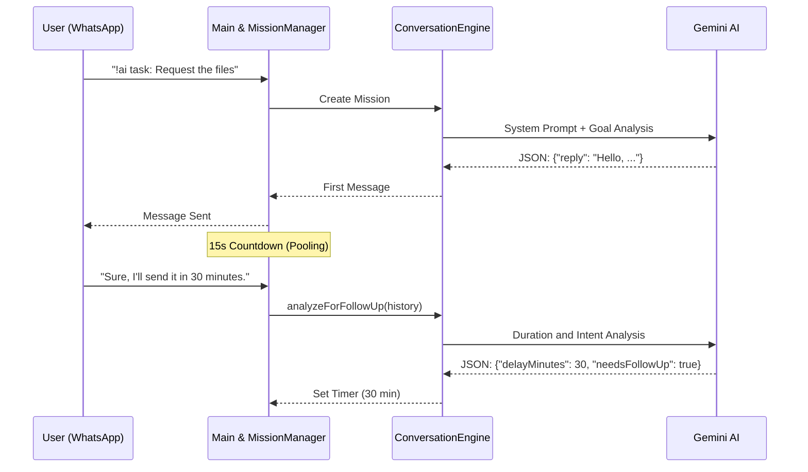

<div align="center">
  
  
  
  
</div>

# Autonomous WhatsApp Agent (Powered by Gemini)

> **Elevator Pitch:** A fully autonomous communication engine that can negotiate, request files, and follow up on commitments on your behalf via WhatsApp. Leveraging Google Gemini AI's superior reasoning capabilities, it communicates asynchronously just like a human and keeps following up until tasks are resolved.

## 📖 Table of Contents
- [✨ Features](#-features)
- [🚀 Quick Start](#-quick-start)
- [🏗️ Architecture Overview](#️-architecture-overview)
- [💻 Usage & API Reference](#-usage--api-reference)
- [🤝 Contributing](#-contributing)

---

## ✨ Features

- **Fully Autonomous Communication:** Manages assigned tasks dynamically using natural language processing (NLP) rather than static commands.
- **Time Awareness & Autonomous Follow-up:** Analyzes timeframes given by the other party (e.g., "I'll send it in half an hour") and sends reminders with natural human timing.
- **Smart Message Pooling:** Combines all messages received within a 15-second window into a single, coherent, contextual response. Reduces API costs and eliminates the "separate reply to every sentence" problem.
- **Resilience:** State is preserved via `data/active_missions.json` even if the server shuts down. Autonomous tasks resume from where they left off upon restart.
- **Group and Direct Message Support:** In group conversations, identifies participants by name and addresses the relevant person directly.

---

## 🚀 Quick Start

### Prerequisites
- **Node.js:** v18.x or higher.
- **Gemini CLI:** The `gemini` command-line tool configured globally on the system, capable of running in headless mode.

### Installation & Running

```bash
# 1. Clone the repository
git clone https://github.com/your-org/whatsapp-autonomous-agent.git
cd whatsapp-autonomous-agent

# 2. Install dependencies
npm install

# 3. Optional: Customize the configuration
nano src/config.js

# 4. Start the agent
npm start
```

Scan the **QR Code** that appears in the terminal with your WhatsApp app to connect the session. (The session will be cached in the `.wwebjs_auth` directory.)

---

## 🏗️ Architecture Overview

The autonomous agent is built on a highly modularized, event-driven architecture.



_For deeper technical details and module analysis, please refer to [ARCHITECTURE.md](ARCHITECTURE.md)._

---

## 💻 Usage & API Reference

The agent is triggered by **structured commands** (CLI-style arguments) sent to your bot number or a group the bot is added to.

### Command Syntax

```text
!ai task: <Task Text> [--tone="..."] [--until="..."]
```

### Arguments

| Argument | Type | Required? | Description |
|----------|------|-----------|-------------|
| `task:` | String | ✅ Yes | The core text describing what you want the bot to do. |
| `--tone` | String | ❌ No | Sets the communication style (Default: Polite and professional). |
| `--until` | String | ❌ No | The "Special Completion Condition" required for the task to successfully close. |

### Usage Examples

**Basic Task:**
```whatsapp
!ai task: Ask Ali for yesterday's presentation notes.
```

**Advanced Task with Arguments:**
```whatsapp
!ai task: Ask the developer to approve the latest PR.
--tone=Firm, serious, and corporate
--until=Until a screenshot of the PR approval from GitHub is shared
```

---

## 🤝 Contributing

If you'd like to contribute to this project:
1. Fork the repository.
2. Create a new branch (`git checkout -b feature/NewFeature`).
3. Commit your changes (`git commit -m 'feat: Added a great feature'`).
4. Push to your branch (`git push origin feature/NewFeature`).
5. Open a Pull Request.

Please make sure to follow code standards (ESLint) and the `doc_writer.md` principles.
